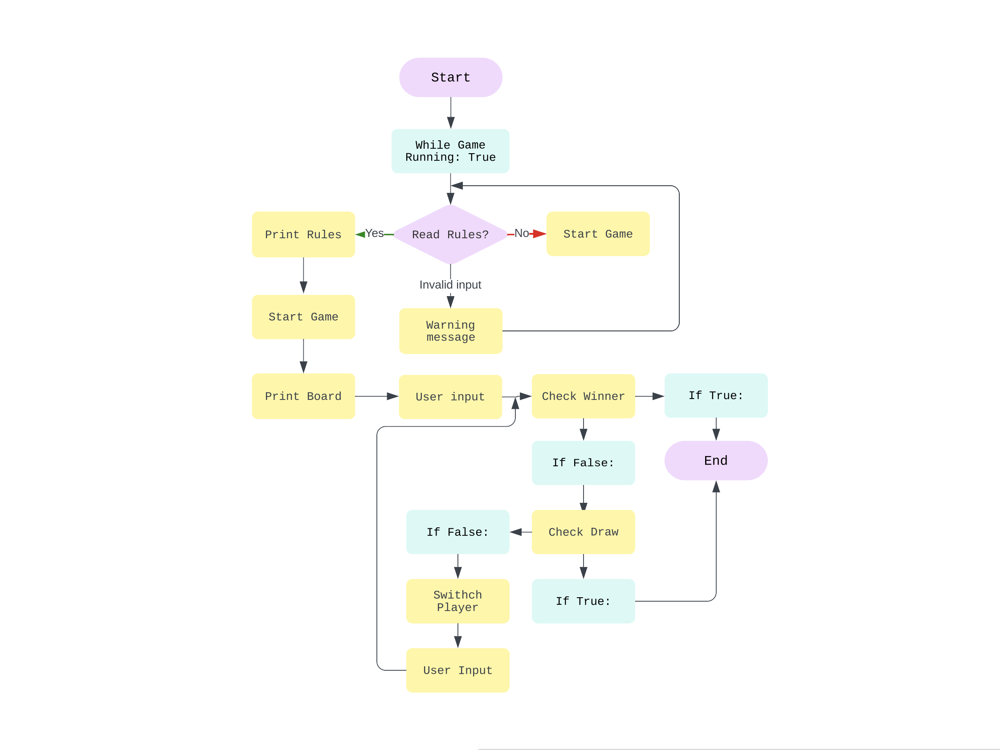

# Tic-Tac-Toe Game  ❌ 🎮 ⭕️ 

### Link to the Live Project: [Tic-Tac-Toe Game](https://tic-tac-toe-pp3-game.herokuapp.com/)

Tic Tac Toe is a traditional game for 2 players. It teaches strategy skills, develops logical thinking, improves the ability to concentrate and focus. It is a simple, fun and easy game which is suitable as for the chealdren, so for the adults or eldery users. 

## CONTENTS

* [User Experience](#user-experience-ux)
  * [User Stories](#user-stories)

* [Design](#design)
  * [Colour Scheme](#colour-scheme)
  * [Logic](#logic)

* [Features](#features)

* [Technologies Used](#technologies-used)
  * [Languages Used](#languages-used)
  * [Frameworks, Libraries and Programs Used](#frameworks-libraries-and-programs-used)

* [Testing](#testing)

* [Deployment](#deployment)

* [Credits](#credits)
  

## User Experience (UX)

### User Stories 
- As a user, I want to understand the purpose of the game.
- As a user, I want to read the rules of the game.
- As a user, I want to play the game against the friend or another user.

### Deloper Goals
- As a developer, I want to build an easy and fun game for all ages users.
- As a developer, I want the users be warned if they input invalid data.
- As a developer, I want the terminal text to be colourfull.

## Design

### Colour Scheme

The colours of the game were supplied by the [Colorama](https://pypi.org/project/colorama/) Python module. 
 - MAGENTA was used for displaying the LOGO, RULES and main text of the game. 
 - YELLOW was used for the game board.
 - CYAN was used for the warning messages. 
 
## Logic

The flow chart was created using [Lucid](https://lucid.co)

## Features

### Logo

The Tic Tac Toe logo in magenta color is shown when the user run the game. It is created using the ASCII art.

### Rules

After starting the game, the user is asked if he wants to read the rules. Rules section is printed in magenta colour and has a logo created using the ASCII art.

### Game board

The game has 3x3 simple game board in yellow colour, that gives positive impression for the user.

### Warning messages

The warning messages are shown when there was an invalid input.

### Winner message

The winner message is shown after the game is finished.

### Future implements

- Take the names of the players
- Score counter

## Technologies used

### Languages used: 

- [Python](https://www.python.org)
 
### Frameworks, Libraries and Programs Used

- [GitHub](https://github.com/) was used for version control and site deployment.
- [Gitpod](https://gitpod.io/) is the Integrated Development Environment (IDE) chosen for this project.
- [Heroku](https://id.heroku.com) was used to deploy the live project.
- [PEP8](http://pep8online.com/) was used to validate all the Python code.
- [Patorjk](https://patorjk.com) was used to create the game ASCII text arts.
- [Colorama](https://pypi.org/project/colorama/) was used to print the colourful text in the terminal.
- [Lucidchart](https://lucid.app/) was used to create the flowchart.

 
## Testing

## Functional testing

| Test                                                                                           | Completed successfully |
| :--------------------------------------------------------------------------------------------- | :--------------------: |
| The game LOGO displayed                                                                        |          Yes           |
| The user is asked if they want to read the RULES                                               |          Yes           |
| If user want to read the Rules after entering the "y" symbol the RULES displayed               |          Yes           |
| If user input incorrect symbol the warning message is shown                                    |          Yes           |
| If user asked about reading the Rules and after entering the "n" the game is started           |          Yes           |
| The first player is generated                                                                  |          Yes           |
| The game board is generated                                                                    |          Yes           |
| Players can enter their moves in alternation                                                   |          Yes           |
| If a field is already occupied, the user will be asked again to enter a move.                  |          Yes           |
| Once a player has won, it is recognized and the game is over.                                  |          Yes           |

## Validator testing

### Pyton Linter

No errors were found when passing through [CI Python Linter](https://pep8ci.herokuapp.com/). However, some warnings regarding whitespace and invalid escape have shown on the result between lines 53-70. They don't affect the functionality of this program, and they are actually necessary to make the logo display correctly.

### Jigsaw Validator

No errors were found when passing through [Jigsaw Validator](https://jigsaw.w3.org/css-validator/validator?uri=https%3A%2F%2Ftic-tac-toe-pp3-game.herokuapp.com%2F&profile=css3svg&usermedium=all&warning=1&vextwarning=&lang=en)

### Lighthouse

Lighthouse Devtools was used to check the accessibility, performance, and SEO:

### Known Bugs

No known bugs were detected.

## Deployment

This application has been deployed by using the Heroku cloud platform.
You can find a [template](https://github.com/Code-Institute-Org/python-essentials-template) prepared by Code Institute that is designed to display this application in a modern web browser. This allows the project to be accessible for users without the need of any third party software other than an Internet browser application.

### Local Deployment

Gitpod IDE is the development environment for this project.

Heroku will need the requirements file to deploy the project succesfully.

- To create the project's requirements use: `pip3 freeze > requirements.txt`.
- Afterwards push latest code to Github.

#### Clone this project by following the steps:

1. Navigate to the main page of the repository on GitHub.com.
2. Click Code above the list of files.
3. You will be provided with three options to choose from, HTTPS, SSH, or GitHub CLI
4. Click the clipboard icon in order to copy the URL
5. Open the terminal
6. Change the current working directory to the location where you want the cloned directory
7. Type git clone, and then paste the URL you copied in step 4

### Heroku Deployment

This project uses the services available at [Heroku] (https://www.heroku.com). Heroku is a Platform as a Service (PaaS) that allows users to create, deploy, and control applications in a cloud environment.

1. Select "New" in the top-right corner in the Heroku Dashboard after log-in.
2. Select the "Create new app" button from the dropdown menu.
3. Assign a unique name to your application.
4. Next select your region
5. Click on the "Create App" button
6. Navigate to the created application and click on "Settings" Tab.
7. Click "Reveal Config Vars".
8. Enter `PORT` into the Key box and `8000` into the Value box and click the Add button.
9. Next enter `CREDS` into the Key box and credentials (ie. from `creds.json`) into the Value box.
10. Scroll down to the Buildpack section click Add Buildpack select Python and click "Save Changes".
11. From the same menu select Node.js and click Save Changes.
12. Navigate to the "Deploy" tab and select the desired deployment method.
13. Select "Enable Automatic Deploy" to rebuild your project automatically every time you push a new commit.
14. Select "Manual Deployment" to manually deploy from your desired branch on will.

## Credits

- [Medium](https://medium.com/byte-tales/the-classic-tic-tac-toe-game-in-python-3-1427c68b8874) article was used to figure out how to draw the game board in Python. 
- [While loops](https://www.w3schools.com/python/python_while_loops.asp) w3schools.com article was used to refresh my knowlege about the loops.
- [Colorama](https://github.com/hameditalha/PythonStringStyle/blob/master/text.py) this tutorial was used to assist work with text colours.

## Acknowledgments

- I would like to thank my husband for his support and my daughter for her help with testing the game.

- Also, I would like to thank my Code Institute mentor, Rory Patrick Sheridan for his support and feedback throughout this portfolio project.

  
